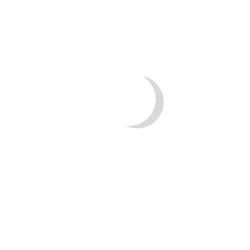
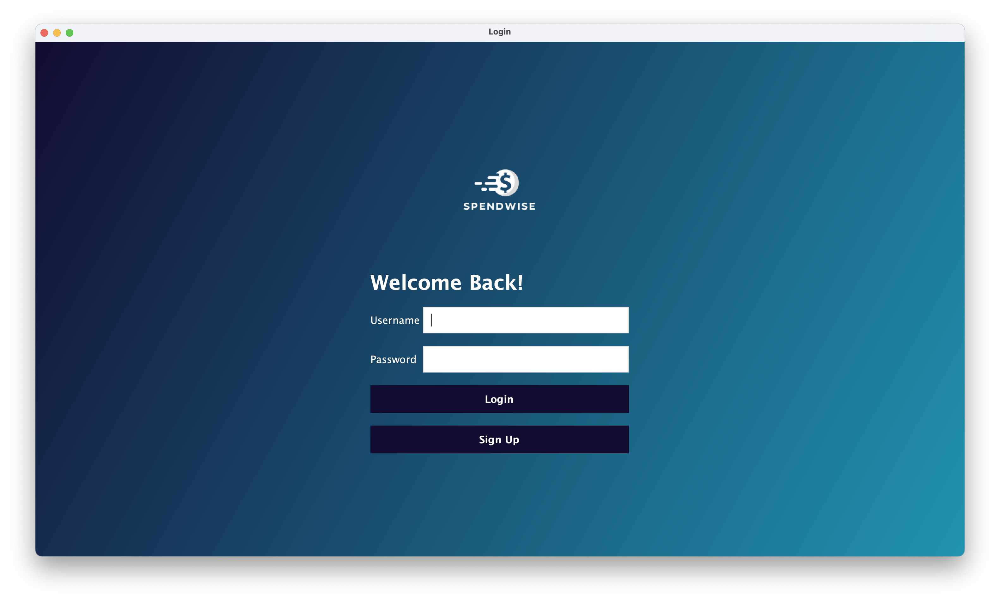
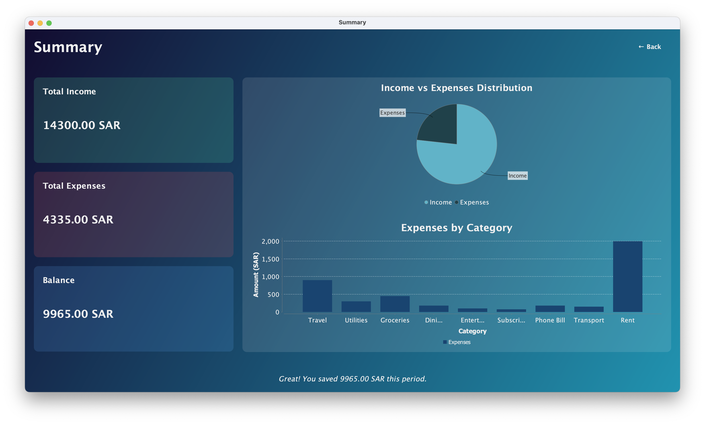
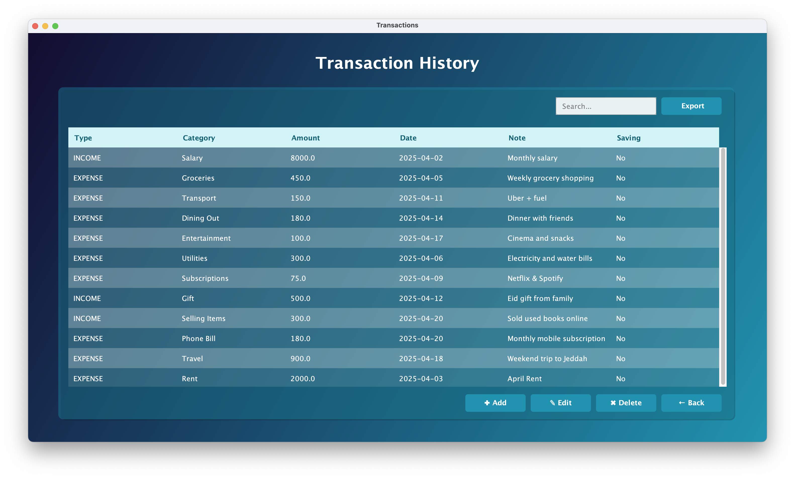

  

# MoneyManager-javaSwing-postgresql-springBoot-desktop-application

A full-stack personal finance manager built with **Java Swing** for the desktop UI, **Spring Boot** for the backend API, and **PostgreSQL** as the database.  
Track transactions, set saving goals, view summaries, and manage your finances with a clean modern interface.

---

##  Features

-  Add, edit, and delete income/expense transactions
-  Set and track personal saving goals
-  View financial summaries (income, expenses, balance)
-  Date picker and filtering for transactions
-  Search functionality for table entries
-  Export transactions to CSV
-  Authentication system (Spring Security)
-  Persistent data storage with PostgreSQL

---

##  Tech Stack

| Layer        | Technology            |
|--------------|------------------------|
| Frontend     | Java Swing (desktop UI) |
| Backend      | Spring Boot (REST API) |
| Database     | PostgreSQL              |
| Build Tool   | Maven                   |
| UI Styling   | Custom Swing components, Gradient UI |
| HTTP Client  | Java `HttpClient` for frontend-backend communication |

---

##  Demo Screenshots

| Login | Dashboard |
|:---:|:---:|
|  |  |

| Add Transaction | Saving Goals |
|:---:|:---:|
|  |  |

| Summary | Transactions Table |
|:---:|:---:|
|  |  |

##  How to Run

###  Prerequisites

- Java 17
- Maven 3.8+
- PostgreSQL installed and running
- Your PostgreSQL database created

### Backend (Spring Boot):

-  Open the backend project.

-  Set up your PostgreSQL database.

-  Update application.properties with your database credentials.

-  Run the Spring Boot application.

### Frontend (Java Swing):

-  Open the Java Swing project.

-  Make sure required libraries (LGoodDatePicker, JFreeChart, json) are added.

-  Run the Main.java file.
